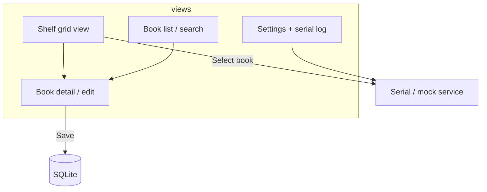

# Library Project — Software Planning

Software-only scope. Hardware is a **single XY plane** behind the whole bookshelf; the app thinks in **grid coordinates** that map to that plane. You handle mechanical testing separately.

---

## Physical ↔ software contract (minimal)

| Software | Hardware (your side) |
|----------|----------------------|
| Each occupied cell has **`x`, `y`** (integers, 0-based) | Gantry moves to calibrated position for that cell |
| User selects a book → app sends **go to (x, y)** then **push** | Firmware moves XY, extends pusher, retracts |
| Cells can be **`book` / `empty` / `other`** | Only `book` cells get valid goto commands |

The app does **not** need step counts or mm in v0 — only **which grid cell**. Firmware (or your test harness) owns the calibration table.

---

## What the app is for

1. **Inventory** — books you own (title, author, optional ISBN, notes, cover).  
2. **Virtual bookcase** — visual grid matching your real shelf; see what lives where.  
3. **Pick a book** — click a cell or list item → highlight shelf → tell hardware to present that book (when connected).  
4. **Work without hardware** — full UI and data locally; serial is optional with a **mock** mode for development.

---

## Product versions (software)

| Version | Features | Hardware |
|---------|----------|----------|
| **S0 — Core** | **5×5** grid; **(0,0) top-left**; add/edit/delete books; assign **x, y**; main shelf view + list; mock present message | None |
| **S1 — Find & polish** | Search/filter; book detail panel; empty vs non-book cells; basic validation (one book per cell) | None |
| **S2 — Serial** | Settings: COM port, connect/disconnect; on select → send `GOTO x y` + `PUSH`; log panel; **mock** prints commands to console | Optional ESP32 |
| **S3 — Nice UI** | Cover images (URL or file); drag book between cells; export/import JSON backup | Same as S2 |

**Start with S0**, then S1, then S2 when you begin firmware testing.

---

## Recommended stack (desktop, Windows)

| Layer | Choice | Why |
|-------|--------|-----|
| **UI** | React + TypeScript | Good for grid layouts and interactive shelf |
| **Build** | Vite | Fast dev, simple |
| **Shell** | **Tauri 2** | Native desktop, small binary, **serial port** access from Rust side (or JS plugin) |
| **Data** | **SQLite** (local file) | One library file, easy backup, no server |
| **ORM** | Drizzle or raw SQL | Light; optional |

**Alternative:** Electron + `serialport` if you prefer more npm-only ecosystem. Tauri is lighter for a personal tool.

**Not recommended for v0:** Cloud backend, accounts, mobile-first — adds scope without helping the shelf.

---

## Data model

### `books`

| Field | Type | Notes |
|-------|------|--------|
| `id` | UUID or integer | Primary key |
| `title` | string | Required |
| `author` | string | Optional |
| `isbn` | string | Optional |
| `notes` | text | Optional |
| `cover_path` | string | Optional; local path or URL (S3) |
| `grid_x` | integer | Column index, 0-based |
| `grid_y` | integer | Row index, 0-based |
| `created_at` | datetime | |
| `updated_at` | datetime | |

**Constraint:** unique `(grid_x, grid_y)` where a book exists — one book per cell.

### `shelf_config` (single row or key-value)

| Field | Example | Notes |
|-------|---------|--------|
| `cols` | 5 | Grid width |
| `rows` | 5 | Grid height (= 25 cells) |
| `cell_types` | JSON map `"x,y" → "book" \| "empty" \| "other"` | Non-book cells: no assign, no hardware goto |

### `app_settings`

| Field | Notes |
|-------|--------|
| `serial_port` | e.g. `COM3` |
| `baud_rate` | e.g. `115200` |
| `hardware_enabled` | If false, mock only |
| `mock_delay_ms` | Simulate move time in dev |

---

## UI structure



### Main views

1. **Shelf (home)**  
   - CSS grid: `rows × cols` cells.  
   - Cell states: empty (book slot), occupied (show title spine or thumbnail), `other` (muted, not assignable).  
   - Click occupied → detail + **“Present book”** (S2).  
   - Click empty book-slot → add book or assign existing.

2. **List**  
   - Table/cards; search by title/author.  
   - Click row → focus that cell on shelf.

3. **Book detail**  
   - Form: metadata + position (x, y) or “pick on shelf” mode.

4. **Settings**  
   - Grid size (locked after data unless migration).  
   - Serial port dropdown, connect, test `HOME` / `GOTO 0 0`.  
   - Command log (last N lines).

---

## Serial protocol (app → device)

Text lines, newline-terminated, UTF-8. Keep it human-readable for serial monitor testing.

| Command | Example | Meaning |
|---------|---------|---------|
| `HOME` | `HOME\n` | Home XY |
| `GOTO` | `GOTO 2 3\n` | Move to grid column 2, row 3 |
| `PUSH` | `PUSH\n` | Extend pusher (after move) |
| `PRESENT` | `PRESENT 2 3\n` | Optional sugar: `GOTO` + wait + `PUSH` (firmware implements) |

**Responses (device → app):**

| Line | Meaning |
|------|---------|
| `OK` | Accepted |
| `BUSY` | Ignore new commands until `DONE` |
| `DONE` | Move/push cycle finished |
| `ERR <message>` | Failed |

**App flow on “Present book”:**

1. If `hardware_enabled` and connected → send `PRESENT x y` (or `GOTO` then `PUSH` after `OK`).  
2. Show “Moving…” until `DONE` or timeout.  
3. If mock → log `[mock] PRESENT 2 3` and optionally delay 1–2 s.

---

## Project layout (software repo)

```
src/
  components/       # ShelfGrid, Cell, BookForm, BookList, Settings
  pages/            # Home, List, Settings (if using router)
  services/
    books.ts        # CRUD
    shelf.ts        # grid config, cell types
    serial.ts       # real + mock implementations
  db/
    schema.ts
    migrations/
  types/
    book.ts
    shelf.ts
docs/
  software-planning.md
  library-project-planning.md   # hardware / overall
```

```
hardware/           # later, not part of S0–S1
  firmware/
```

---

## Checklist — software S0

- [ ] Init Tauri + React + TypeScript + SQLite  
- [ ] Define schema: `books`, `shelf_config`, `app_settings`  
- [ ] Shelf grid component (configurable rows/cols)  
- [ ] CRUD books + assign `(grid_x, grid_y)`  
- [ ] Mark cells as `other` (non-book) in config  
- [ ] Persist DB to user data directory  

## Checklist — software S1

- [ ] Search / filter list  
- [ ] Book detail view linked from grid + list  
- [ ] Enforce one book per cell  
- [ ] Show coordinates on hover or label (for your hardware testing)  

## Checklist — software S2

- [ ] Serial service interface + **mock** implementation  
- [ ] Settings: port, baud, enable hardware  
- [ ] “Present book” button + status + command log  
- [ ] Timeouts and `ERR` handling  

---

## Open decisions (software)

1. ~~**Grid default**~~ — **5×5** (locked in app).  
2. ~~**Origin**~~ — **(0,0) top-left**.  
3. ~~**Tauri**~~ — in use.  
4. **S0 extras** — ISBN lookup API later, or manual entry only for now?

**S0 base is implemented** in repo root (`npm run dev`). Iterate UI/flow, then S2 serial.
